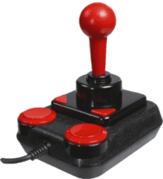
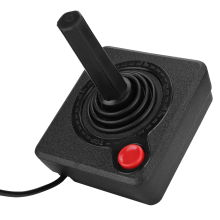
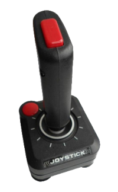
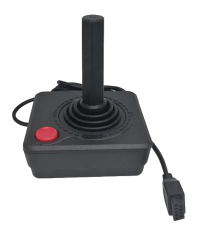
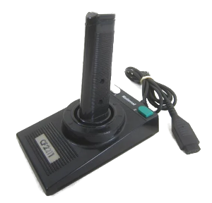

# Classic Joystick

This example can used to connect the following controllers:

<table border="5" align="center" style="width:100%">
    <tr>
        <td>Commodore 64/Amiga</td>
        <td>Atari 2600/XL/ST</td>
        <td>ZX Spectrum</td>
    </tr>
    <tr>
        <td></td>
        <td></img></th>
        <td></img></th>
    </tr>
    <tr>
        <td>Amstrad CPC</td>
        <td>MSX</td>
        <td>Others</td>
    </tr>
    <tr>
        <td></td>
        <td></img></th>
        <td align="center">If you know or  have tested other,  please add to  the list.</td>
    </tr>
</table>

## Credits

* Original Author: [John Milner](https://github.com/jfrmilner)
* Modified version: [Wolf](https://github.com/Wolf359Stella)

## Pinout
Pinout for all classic joystick. [Source here](http://old.pinouts.ru/Inputs/ControlPortC64_pinout.shtml), but also created a copie if it goes offline.

<h4>Control Port 1</h4>
<table width="90%" style='font-family:"Courier New", Courier, monospace; font-size:80%'>
    <tbody>
        <tr>
            <th>Pin</th>
            <th>Name</th>
            <th>Dir</th>
            <th>Comment</th>
        </tr>
        <tr>
            <td>1</td>
            <td>JOYA0</td>
            <td>INPUT</td>
            <td>UP</td>
        </tr>
        <tr>
            <td>2</td>
            <td>JOYA1</td>
            <td>INPUT</td>
            <td>DOWN</td>
        </tr>
        <tr>
            <td>3</td>
            <td>JOYA2</td>
            <td>INPUT</td>
            <td>LEFT</td>
        </tr>
        <tr>
            <td>4</td>
            <td>JOYA4</td>
            <td>INPUT</td>
            <td>RIGHT</td>
        </tr>
        <tr>
            <td>5</td>
            <td>POT AY</td>
            <td>BIDIR</td>
            <td></td>
        </tr>
        <tr>
            <td>6</td>
            <td>BUTTON A/LP</td>
            <td>BIDIR</td>
            <td>FIRE</td>
        </tr>
        <tr>
            <td>7</td>
            <td>+5V</td>
            <td>POWER</td>
            <td>50 mA max</td>
        </tr>
        <tr>
            <td>8</td>
            <td>GND</td>
            <td>GND</td>
            <td></td>
        </tr>
        <tr>
            <td>9</td>
            <td>POT AX</td>
            <td>BIDIR</td>
            <td></td>
        </tr>
    </tbody>
</table>
<h4>Control Port 2</h4>
<table width="90%" style='font-family:"Courier New", Courier, monospace; font-size:80%'>
    <tbody>
        <tr>
            <th>Pin</th>
            <th>Name</th>
            <th>Dir</th>
            <th>Comment</th>
        </tr>
        <tr>
            <td>1</td>
            <td>JOYB0</td>
            <td>INPUT</td>
            <td>UP</td>
        </tr>
        <tr>
            <td>2</td>
            <td>JOYB1</td>
            <td>INPUT</td>
            <td>DOWN</td>
        </tr>
        <tr>
            <td>3</td>
            <td>JOYB2</td>
            <td>INPUT</td>
            <td>LEFT</td>
        </tr>
        <tr>
            <td>4</td>
            <td>JOYB4</td>
            <td>INPUT</td>
            <td>RIGHT</td>
        </tr>
        <tr>
            <td>5</td>
            <td>POT BY</td>
            <td>BIDIR</td>
            <td></td>
        </tr>
        <tr>
            <td>6</td>
            <td>BUTTON B</td>
            <td>BIDIR</td>
            <td>FIRE</td>
        </tr>
        <tr>
            <td>7</td>
            <td>+5V</td>
            <td>POWER</td>
            <td>50 mA max</td>
        </tr>
        <tr>
            <td>8</td>
            <td>GND</td>
            <td>GND</td>
            <td></td>
        </tr>
        <tr>
            <td>9</td>
            <td>POT BX</td>
            <td>BIDIR</td>
            <td></td>
        </tr>
    </tbody>
</table>

Note: Direction is Computer relative Device. 
Note: Pot is a linear 470 kOhm (?10 %)

## Material

* [John Milner's Project for Commodore](https://jfrmilner.wordpress.com/2016/07/17/arduino-project-commodore-64amiga-atari-2600xlst-zx-spectrum-joystick-to-windowslinux-retropie-usb)
