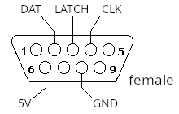
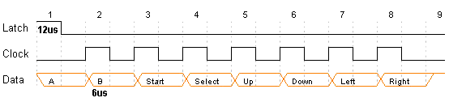

# NES Clone

This example can used to connect the following controllers:

* PolyStation

</img></th>

## Credits
* Modified version: [Wolf](https://github.com/Wolf359Stella)

## Pinout

 * The gamepad does not follow the same protocol as the SNES.
 * It has more buttons, but only 10 are useful simulatenously (smaller than SNES's). This is not a hardware limitation (talking about the gamepad). The embedded asic generates a internal 15 Hz clock and make some signal filtering to get the following behaviors.
    * X, &#9723;, L1 and L2 have the same output bit.
    * &#9723; and L1 only sets once every 2 cycles.
    * &#9651;, &#9711;, R1 and R2	has the same output.
    * &#9651; and R1 only sets once every 2 cycles

## Material

   <h3>Protocol package<h3>
   
   <h3>Protocol package vizualization <h3>
   

