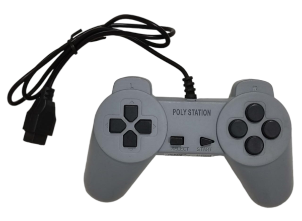
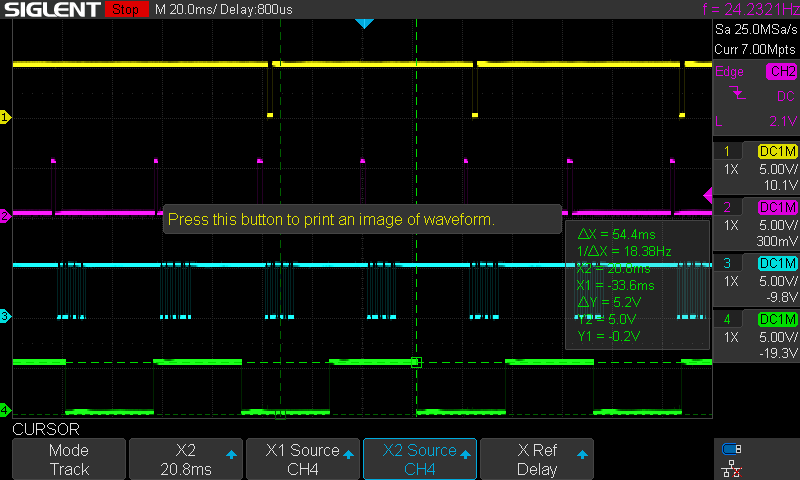

# NES Clone

This example can used to connect the following controllers:

* PolyStation

</img></th>

## Credits
* Originl version: [Wolf](https://github.com/Wolf359Stella)

## Pinout

 * The gamepad does not follow the same protocol as the SNES.
 * 
 * The package is a singe byte (8-bit)
 * All the buttons are connected to a GND and a Vdd-driven signal. When the signal is grounded the signal goes to 0, representing that the button was pressed. The exceptions are the &#9723;, &#9651;, L1, L2, R1 and R2, which are connected to a internal clock (13.3Hz). (show as the green signal in the image "Protocol package vizualization"). All these internal clock signals are in phase.
 * There are also buttons connected in parallell. 
   * &#9651;, &#9711;, R1 and R2 has the same output.
   * X, &#9723;, L1 and L2 have the same output.
 * Because of that it is NOT possible (as far as I could figure out) to differenciate between
   * &#9651; and R1
   * &#9711; and R2
   * &#9723; and L1
   * X and L2
 * Because of that all the trigger buttons are ignored. So the joystick can still be used, but is not very good of a joystick. I have no idea why they choose to do it this way. And I have no idea how polystation got to figure out the triggers.

## Material

   <h3>Protocol package<h3>
   
   <h3>Protocol package vizualization <h3>
   

