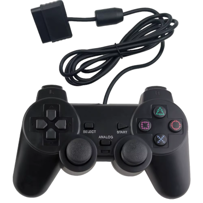
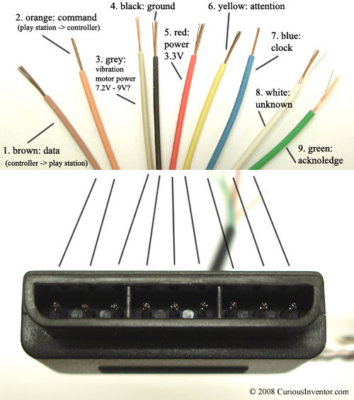

# Play Station 2

This example can be used the following controllers:

* Play Station 2

</img></th>

## Credits
* Original Author: [Shutter](https://github.com/jfrmilner)
* Modified version: 
    * Bill Porter (Made into lib and support) 
    * Eric Wetzel (thewetzel@gmail.com) (Contributor)  
    * Kurt Eckhardt  (Contributor)  
    * [Wolf](https://github.com/Wolf359Stella) (Contributor)  

## Pinout
Pinout for joystick.

</img></th>
