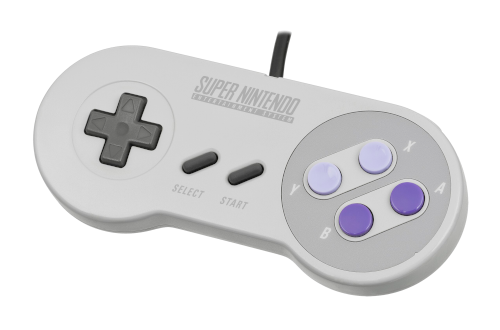
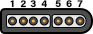

# SNES Joystick

This example can be used the following controllers:

* Super Nintendo Entertainment System

</img></th>

## Credits
* Original Author: [John Milner](https://github.com/jfrmilner)
* Modified version: [Wolf](https://github.com/Wolf359Stella)

## Pinout
Pinout for all classic joystick. [Source here](https://consolemods.org/wiki/SNES:Connector_Pinouts), but also created a copie if it goes offline.

 
</img>
<table class="wikitable H2-section">
    <tbody>
        <tr>
            <th>Pin #</th>
            <th>Description</th>
            <th>Wire Color
            </th>
        </tr>
        <tr>
            <td>1</td>
            <td>+5v</td>
            <td>White
            </td>
        </tr>
        <tr>
            <td>2</td>
            <td>Data Clock</td>
            <td>Yellow/Red
            </td>
        </tr>
        <tr>
            <td>3</td>
            <td>Data Latch</td>
            <td>Orange
            </td>
        </tr>
        <tr>
            <td>4</td>
            <td>Serial Data</td>
            <td>Red/Yellow
            </td>
        </tr>
        <tr>
            <td>5</td>
            <td>N/C</td>
            <td>-
            </td>
        </tr>
        <tr>
            <td>6</td>
            <td>N/C</td>
            <td>-
            </td>
        </tr>
        <tr>
            <td>7</td>
            <td>Ground</td>
            <td>Brown
            </td>
        </tr>
    </tbody>
</table>

## Material

* [John Milner's Project for SNES](https://jfrmilner.wordpress.com/2016/07/17/arduino-project-super-nintendo-entertainment-system-snes-controllergamepad-to-windowslinux-retropie-usb/)

